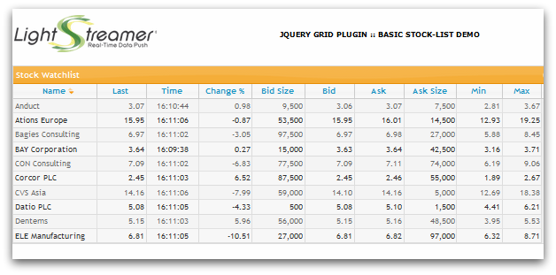

# Lightstreamer - Basic Stock-List Demo - HTML (jQuery, jqGrid) Client

<!-- START DESCRIPTION lightstreamer-example-stocklist-client-jquery -->

This demo displays real-time market data for ten stocks, generated by a feed simulator in a similar way to the [Lightstreamer - Basic Stock-List Demo - HTML Client](https://github.com/Lightstreamer/Lightstreamer-example-StockList-client-javascript#basic-stock-list-demo---html-client).<br>

## Live Demo

[](https://demos.lightstreamer.com/jqGridDemo/)<br>
### [ View live demo](https://demos.lightstreamer.com/jqGridDemo/)<br>

## Details

This page uses the <b>JavaScript Client API for Lightstreamer</b> to handle the communications with Lightstreamer Server and uses <b>jqGrid</b> to display the real-time data pushed by Lightstreamer Server.<br>
A Lightstreamer Subscription is used for subscribing to the data. The onItemUpdate callback implementation acts as a bridge between Lightstreamer and jqGrid, by injecting the real-time updates through the setRowData function.<br>
Click on the Name column header to resort the stocks in the table.<br>

The demo includes the following client-side functionalities:
* A [Subscription](https://lightstreamer.com/api/ls-web-client/latest/Subscription.html) containing 10 items, subscribed to in <b>MERGE</b> mode.

<!-- END DESCRIPTION lightstreamer-example-stocklist-client-jquery -->

## Install

If you want to install a version of this demo pointing to your local Lightstreamer Server, follow these steps:

* Note that, as prerequisite, the [Lightstreamer - Stock- List Demo - Java Adapter](https://github.com/Lightstreamer/Lightstreamer-example-Stocklist-adapter-java) has to be deployed on your local Lightstreamer Server instance. Please check out that project and follow the installation instructions provided with it.
* Launch Lightstreamer Server.
* Get the `lightstreamer.min.js` file from [npm](https://www.npmjs.com/package/lightstreamer-client-web) or [unpkg](https://unpkg.com/lightstreamer-client-web/lightstreamer.min.js) and put it in the `src/js` folder of the demo (if that is the case, please create it).
  Alternatively, you can generate a customized lightstreamer.min.js library containing only the classes you actually use;
  see the build instructions on the [GitHub page](https://github.com/Lightstreamer/Lightstreamer-lib-client-javascript#building).
  In that case, be sure to include the LightstreamerClient, Subscription, ConnectionSharing, and StatusWidget modules. 
* Get the `require.js` file form [requirejs.org](http://requirejs.org/docs/download.html) and put it in the `src/js` folder of the demo.
* To use jqGrid, first, a UI theme css file should be loaded. Download the desired theme (or build a custom one) from [jQueryUI](http://jqueryui.com/) site, get from the zip file the `jquery-ui-1.x.x.custom.min.css` file and `src/images` folder, and put them in `src/css` folder of the project.
* Download the jqGrid package from the [site section downloads](http://www.trirand.com/blog/). Get the i18n folder and `jquery.jqGrid.min.js`, j`query-1.9.0.min.js` files and copy them in `src/js` folder of this project. Then get the `ui.jqgrid.css` file and copy it in `src/css` folder of this project.

You can deploy the demo to use the Lightstreamer server as Web server or in any external Web Server you are running. 
If you choose the former case, please create the folders `<LS_HOME>/pages/demos/[demo_name]` then copy here the contents of the `src` folder of this project.<br>
The client demos configuration assumes that Lightstreamer Server, Lightstreamer Adapters, and this client are launched on the same machine. If you need to target a different Lightstreamer server, please search this line:
```js
var lsClient = new LightstreamerClient(protocolToUse+"//localhost:"+portToUse,"DEMO");
```
in `lsClient.js` and change it accordingly.<br>

The demo is now ready to be launched.

## See Also

### Lightstreamer Adapters Needed by This Demo Client

<!-- START RELATED_ENTRIES -->
* [Lightstreamer - Stock- List Demo - Java Adapter](https://github.com/Lightstreamer/Lightstreamer-example-Stocklist-adapter-java)
* [Lightstreamer - Reusable Metadata Adapters- Java Adapter](https://github.com/Lightstreamer/Lightstreamer-example-ReusableMetadata-adapter-java)

<!-- END RELATED_ENTRIES -->

### Related Projects

* [Lightstreamer - Stock-List Demos - HTML Clients](https://github.com/Lightstreamer/Lightstreamer-example-Stocklist-client-javascript)

## Lightstreamer Compatibility Notes

* Compatible with Lightstreamer JavaScript Client library version 6.0 or newer (installation instructions for version 8.0 or newer).
